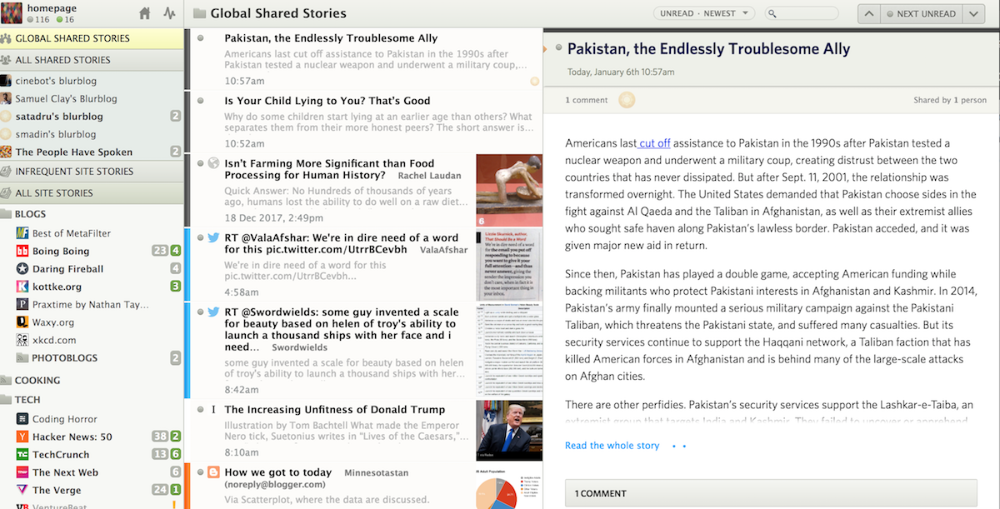

Awesome open-sourced Django projects that you can fork to jump start your next project. 

## Spirit

A python based forum website with login, notifications, and a responsive design.

[Fork it on Github](https://github.com/nitely/Spirit)

[View the Live Demo](https://spirit-project.com/)

---
## Drum

A Reddit/Hacker News clone based on Django and Mezzanine.

[Fork it on Github](https://github.com/stephenmcd/drum)

[View the Live Demo](http://drum.jupo.org/)

---
## Review Board

A bug tracking tool for companies and developers to stay organized.

[Fork it on Github](https://github.com/reviewboard/reviewboard)

[View the Live Demo](http://demo.reviewboard.org/r/)

---
## Bootcamp

A social media based site with a main feed where you can post comments and articles and interact with other users. 

[Fork it on Github](https://github.com/vitorfs/bootcamp/)

[View the Live Demo](http://trybootcamp.vitorfs.com/)

---
## Edge

Basic project starter app using Bootstrap 3 with user authentication and a profile page.

[Fork it on Github](https://github.com/arocks/edge)

[Screenshots and Docs](http://django-edge.readthedocs.io/en/latest/)

---
## Dashing

A fun looking personal dashboard.

[Fork it on Github](https://github.com/talpor/django-dashing/)

[View the Live Demo](https://django-dashing-demo.herokuapp.com/dashboard/)

---
## NewsBlur

A personal news reader site.

[Fork it on Github](https://github.com/samuelclay/NewsBlur/)

[View the Live Demo](http://www.newsblur.com/)

